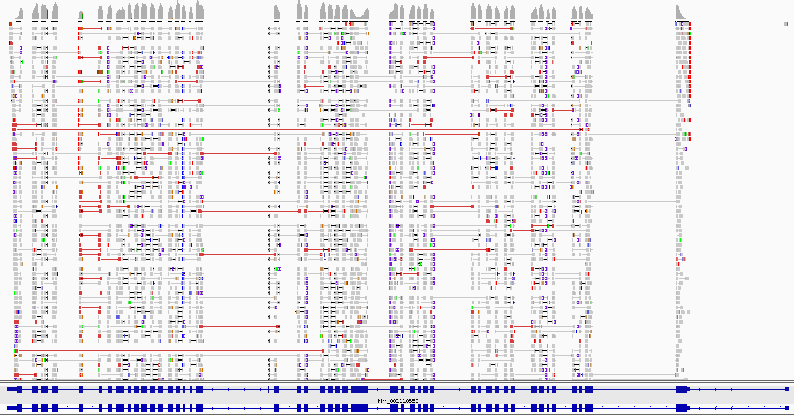
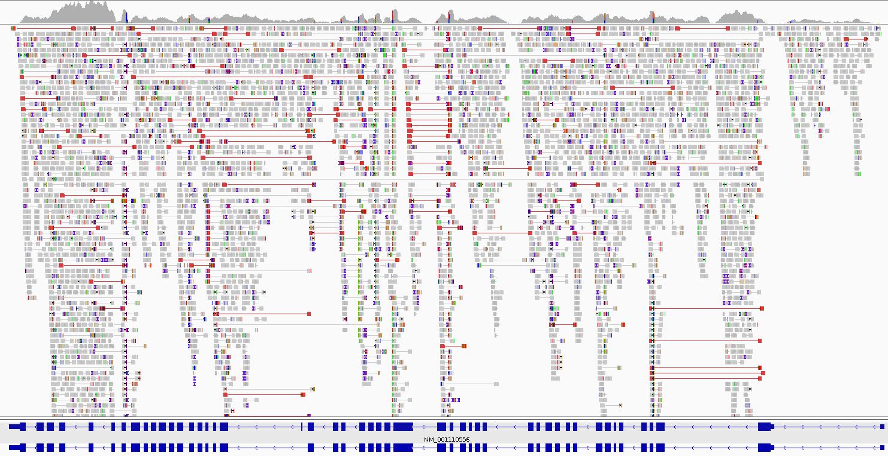

.. trcls documentation master file, created by
   sphinx-quickstart on Fri Jul 19 09:46:53 2019.
   You can adapt this file completely to your liking, but it should at least
   contain the root `toctree` directive.

trcls
=====

.. raw:: html

    <link rel="stylesheet" type="text/css" href="_static/custom.css">

*trcls* (**Tr**\ anscript **Cl**\ a\ **s**\ sifier) annotates a SAM alignment
file with potential splice variants using known features from a GTF annotation
file.

.. toctree::
    :maxdepth: 2
    :caption: Contents

    installation
    quickstart
    options
    support
    poster

Showcase
--------

    IGV visualisation of identified and annotated FLNA mature mRNA reads.

    IGV visualisation of identified and annotated FLNA mature pre-mRNA reads.
